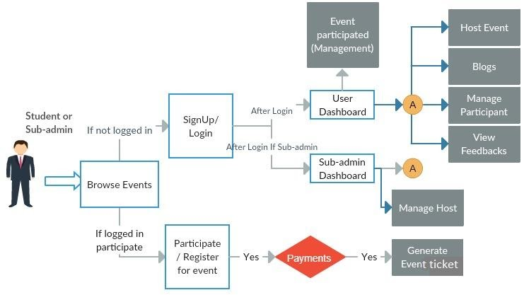
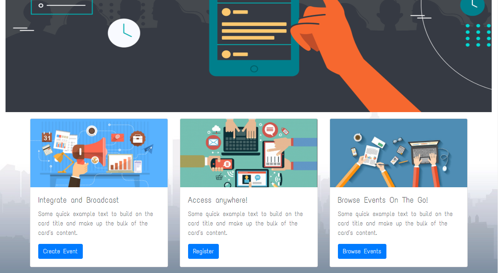
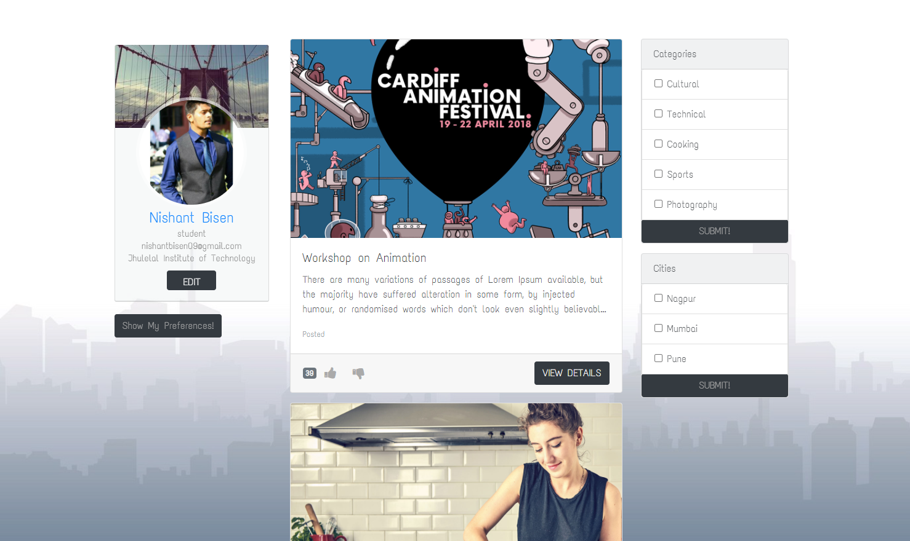
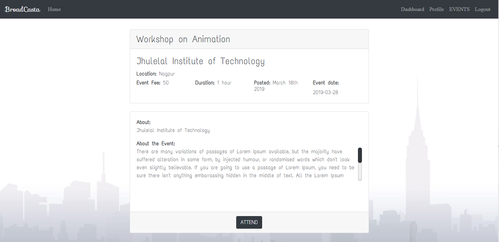
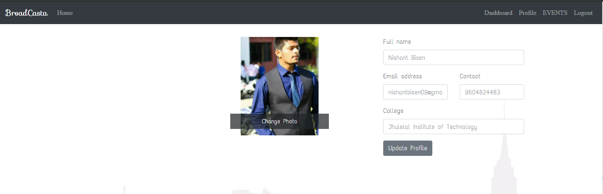

# Broadcasta (EIS) -  A large scale event integrated system.

### Abstract
Event Integrated System is a platform where students can post events and workshops of their colleges as like they post news feeds in other social media platforms. With the help of this system, students of different colleges will be aware of different college activities that are happening in their locality. The major advantage of this web portal is that we do not have to spend time on promotion of events. All the hectic work related to promotion of particular events is performed online. Many times, we see that there are clashes of events of different colleges on the same date. With the help of this system, this problem can be eliminated up to a higher extent and this will increase the overall participation in a particular event of a college. The technology used to build this system is Node.js and Angular.js and the database used is MongoDB.

### Aim & Objective
The project mainly aims to make each student aware of the various events and workshops that are held in their own or nearby cities. With the help of this, students can easily participate in those events which belongs to their domain of interest. This will increase the overall participation of all the events in different colleges.
The expenditure that is spent on promotions will be reduced to huge extent. It can also be proved as a remarkable step towards ‘DIGITAL INDIA’ campaign.
All the underrated colleges can be put forward with the help of this system. Students will come to know about different newbie colleges and their environment by participating in their events and workshops.

### Proposed Methodology/Theory of Techniques

Students can host events from their respective colleges and hence post all the event details and also manage participants and payments.
There will be a sub admin for every college who will manage all the posted events i.e., to perform actions like approve or reject. The sub-admin can be any faculty in-charge or event in-charge.
Location based search for students who are willing to find events in their locality
Separate forum for each event to review the event and to also discuss regarding any requirements etc.
Data analytics for user interest based custom feeds.

 ### Conceptual Design Data flow Diagram/ Block Diagram/ System Architecture
 From the below figure , it is evident that both student and sub-admin first interacts with the browse events window. From there, students can login/signup and participate in different events. 
Every college has its own registered sub-admin who can approve or discard various events that are posted by the students of their college. Each student and sub-admin has their own dashboard. Student dashboard consists of various sections such as host events, blogs, managing participants and view feedback. Sub-admin dashboard consists of sections such as  manage host and the list of events that are approved by them.
As we have a portal to manage the events from the sub-admin module. The host or the student posts an event which is forwarded to sub-admin. A sub-admin is responsible for the validation of the event. If the sub-admin approves the event then only it is hosted globally.
Apart from this, there is a payments section which is responsible for generating event tickets and gives the count of the number of interested students to the event organizer.

# Screenshots

## Home Page

## Events

## Event Details

## Edit Profile

### A. STUDENT MODULE:
Students will be able to browse all the events which are publicly posted and approved. He will also have access to the discussion forum below all the events, but in order to register for any event or create an event the student will have to register or login.
This module is subdivided in two categories:
a. HOST
b. MEMBER
 
**a. HOST**: Any student who has authority to post events is HOST. Users should register him/herself as a HOST by providing their sub-admin referral code. Host user will have following functionalities:
Registration: This module is common to host as well as members. Every user should register him/herself to access functionalities like (post blog, participate in event, host an event, etc.). If a user wants to register as a host then he/she must provide a sub-admin referral code. Every host will be approved by sub-admin.
Login: All registered members can be logged-in by using this module. 
Create Event: This module will allow the user to create an event to broadcast it to all. Every created event will be forwarded to sub-admins for approval. As soon as the sub-admin approve event it will be visible to all. For creating event host should provide following details:
- Event title
- Event image
- Event description
- Event fees
- Event schedule (date and time)
- Venue
- Perks	
- Maximum participants

**My Events:** This module will have following features:
- Events list along with their status (Approved / Rejected)
- Event Details
- Event Enquiries
- Participant list
- Payment Entries
- Participation cancel requests
- Refunds
- Event History

**Feature My Event:** If a host is willing to see his event appear on the top of all the feeds he can request to feature his event.
**My Profile:** Every registered user can view/ update his profile.

**My Interest:** Every member can provide his/her area of interest to apply filters on events he/she will have in the dashboard.
**Events:** All broadcasted events will be listed in this module. User will get an event list in his/her dashboard area. This module has following features:
- Browse event list
- Apply filters on event list
- View Event details
- Send Enquiry for events
- participate in an event
- Receive ticket after fees payment.
- Access participated events list and details
- Give feedback for participated events

**Blogs:** Users will be able to write blogs to provide some useful information to other users.

**b. MEMBER:** Any student who has registered with him/her in his application to write blogs, participate in an event will be considered as a member. A member will have following functionalities:
- Register

**B. SUB-ADMIN MODULE:** A sub admin would generally be a person in charge or a person representing the college who is an official employee of the organization. He will have to register in the application in order to approve the posts of the hosts from his respective college. He will also be able to browse all the events that are publicly posted and approved. He will also have access to the discussion forum below all the events. All sub-admins registration will be approved by admin.
- Event Requests:This module will facilitate sub-admin to approve all events from his hosts. This functionality will be helpful for admin to authenticate events before broadcasting. 
- Accept / Reject events
- Events List: A list of events along with their status (Approved / Rejected).
- Events Details
- Cancel Event
- My Profile: This module will allow to manage own/institute details like:
College / University name
User name
Personal mobile no.
Collage / Institute contact no.
Address
Profession / Designation
Referral Code (View Only)
College / Institute website 
email id
Share referral code

### ADMIN Module
An admin would be the highest in the hierarchy. He will have access to all the modules from the backend so as to manage the proper and smooth functioning of the application.
An admin would manage:
- Events
- Complaints
- Sub admins
- Hosts
- Colleges
- Featuring
- Blogs
